# mcylCodeGenerator
## 一个针对oracle数据库的C#代码生成器
### 1.此类依赖于基础的数据库操作类，oracleDBHelper.cs或者sqlServer2kDBHelper.cs，分别为oracle的数据库操作类和sqlServer2000的数据库操作类（可根据情况自己修改）
### 2.有几句加密狗的校验代码，删除后再用
### 3.此类可以生成DAL层的基本增删查改，批量增删改，根据特殊条件的删改，查询到的数据关联外键表对象的方法，分页的相关处理
### 4.可以生成基本的BLL层代码及model代码以及一些项目中用到的和界面winform耦合较高的一些方法
### 5.当初考虑使用T4模板引擎，后来未使用，代码的生成使用纯拼接字符串处理
### 5.此工具属于本人的his系统附属工具，需要配套参考

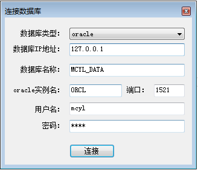
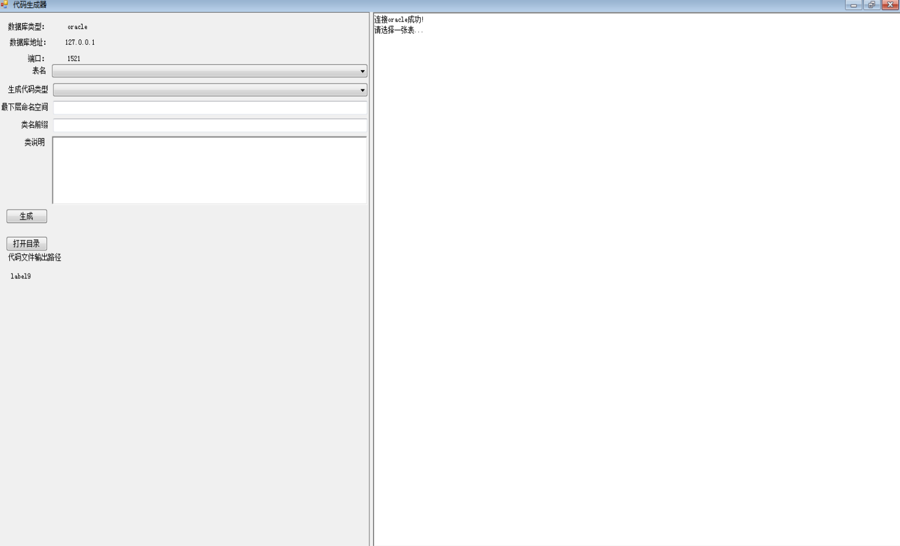
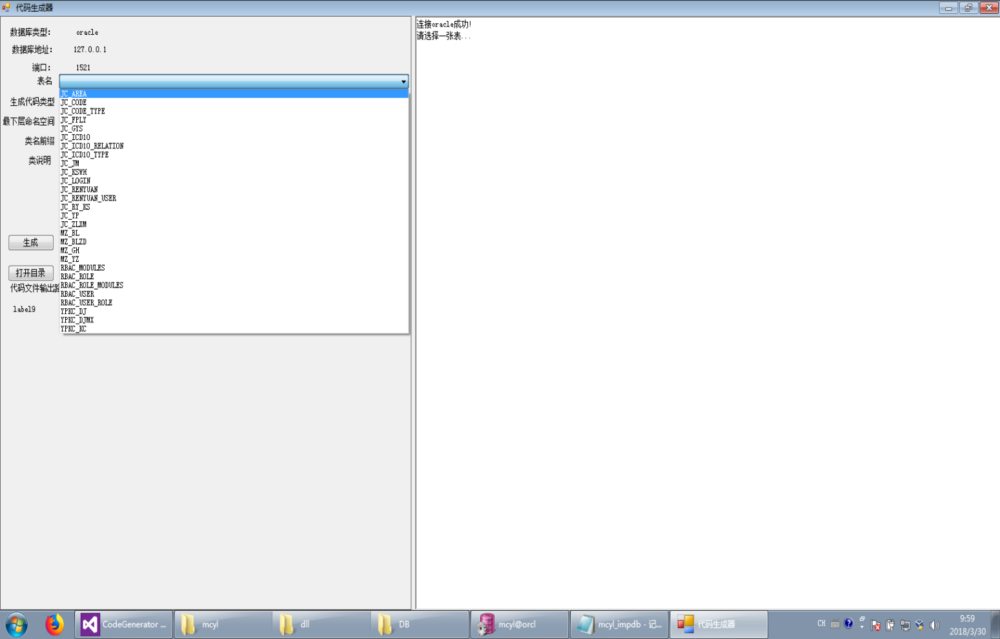
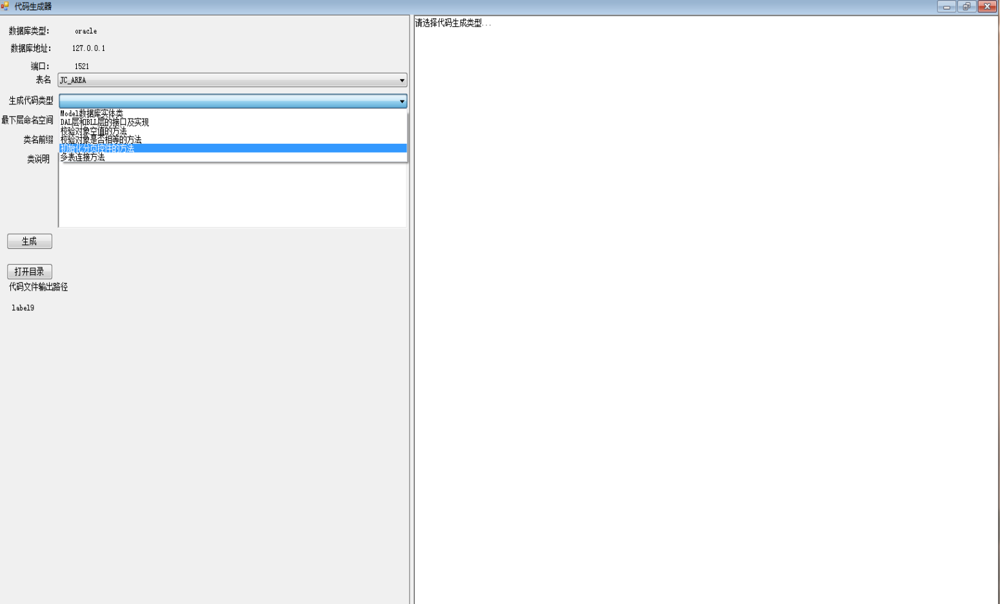
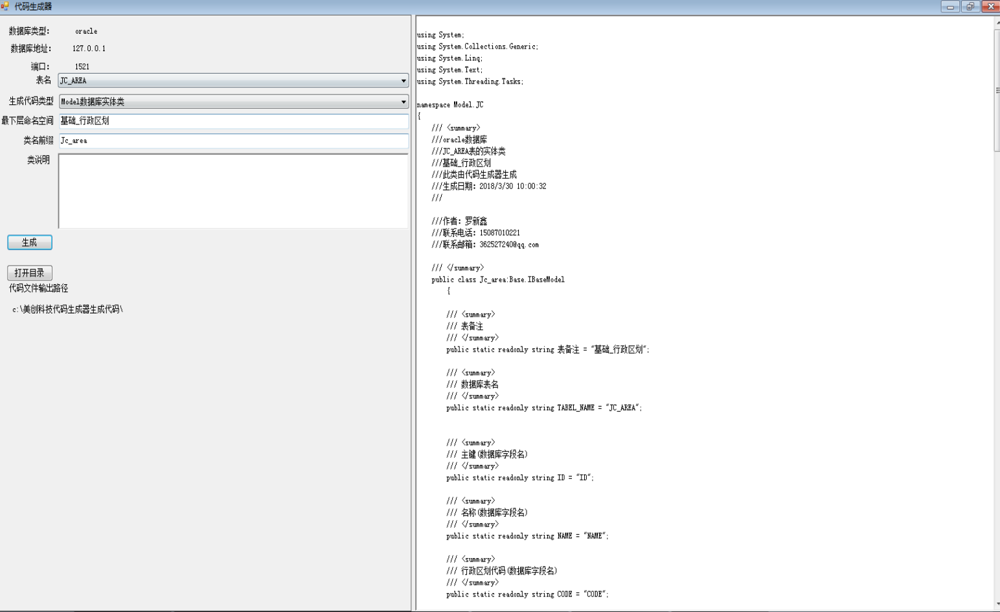
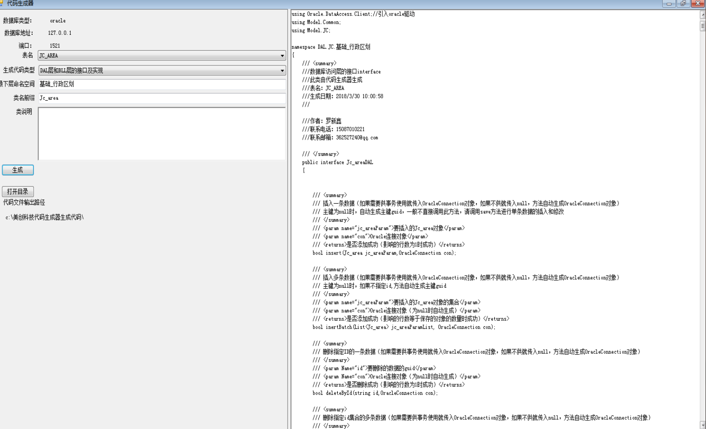
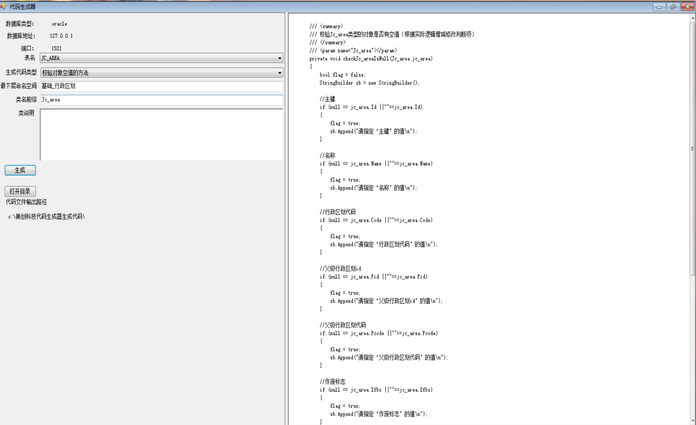
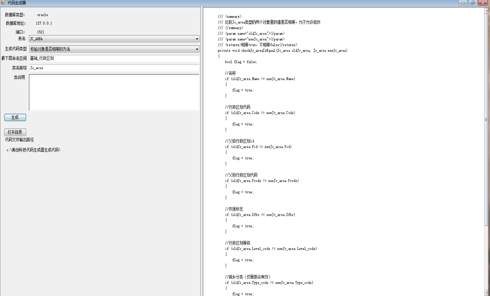
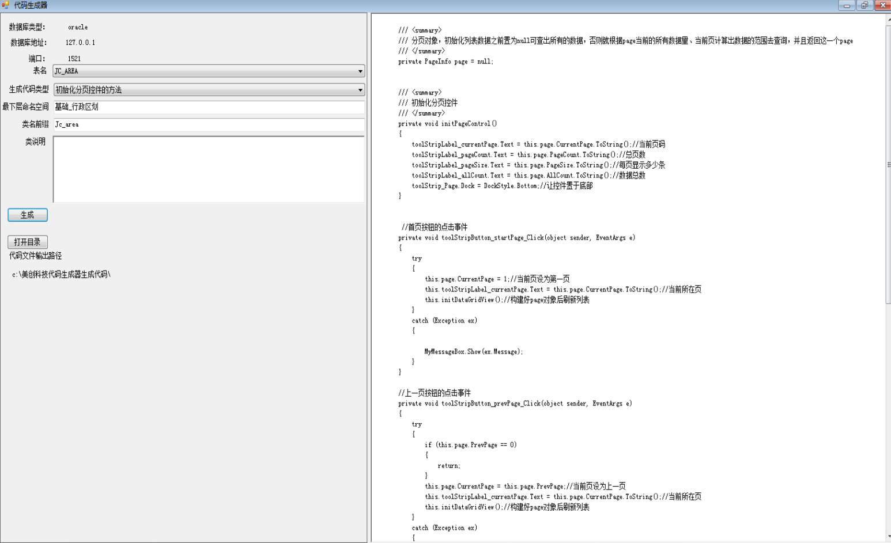
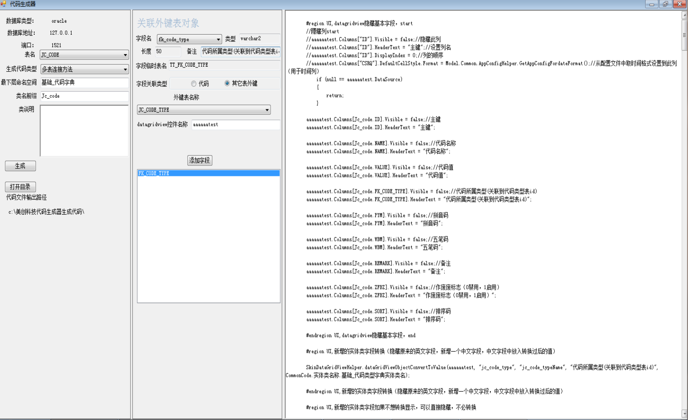
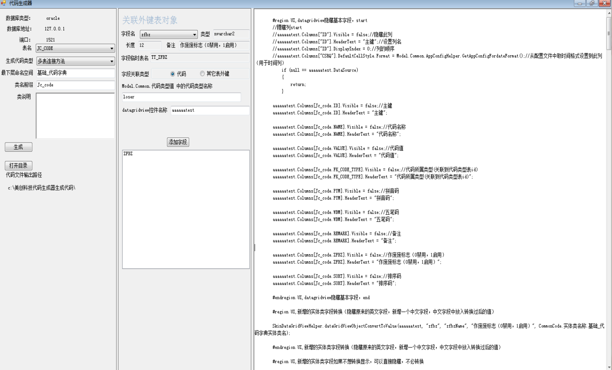

[基于C#的his系统](https://github.com/xinxin321198/mcyl/) 
[代码生成器](https://github.com/xinxin321198/mcylCodeGenerator) 
[文档](https://github.com/xinxin321198/mcylDoc) 

* 昵称：loserStar 
* email:xinxin321198@gmail.com 
* email2:362527240@qq.com 
* qq:362527240 
* github:https://github.com/xinxin321198 
